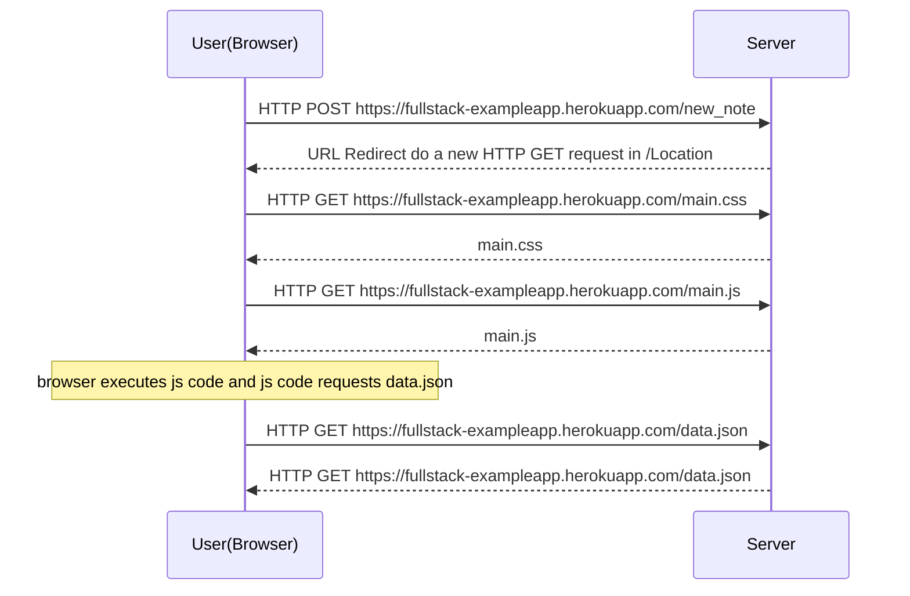

```mermaid
sequenceDiagram
    participant User(Browser)
    participant Server
    User(Browser)->>Server: HTTP POST https://fullstack-exampleapp.herokuapp.com/new_note
    Server-->>User(Browser): URL Redirect do a new HTTP GET request in /Location
    User(Browser)->>Server: HTTP GET https://fullstack-exampleapp.herokuapp.com/main.css
    Server-->>User(Browser): main.css
    User(Browser)->>Server: HTTP GET https://fullstack-exampleapp.herokuapp.com/main.js
    Server-->>User(Browser): main.js
    Note over User(Browser): browser executes js code and js code requests data.json
    User(Browser)->>Server: HTTP GET https://fullstack-exampleapp.herokuapp.com/data.json
    Server-->>User(Browser): HTTP GET https://fullstack-exampleapp.herokuapp.com/data.json
    
```
